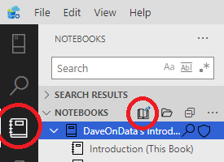
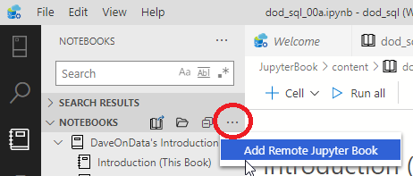
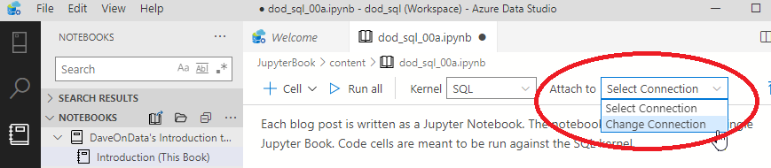

# DaveOnData's Introduction to SQL for Excel Users

## Overview

DaveOnData's blog posts converted to Jupyter Book.  The aim was to have the SQL content in cells that could be executed against a live AdventureWorksDW database connection.  

[Original blog series](https://www.daveondata.com/blog/category/sql-for-excel-users/)

## Prerequisites

- Azure Data Studio
- AdventureWorksDW database

## How to Use
Each blog post is written as a Jupyter Notebook. The notebooks are collected into a single Jupyter Book. Code cells are meant to be run against the SQL kernel.

Download and expand the book contents into its own folder.

In Azure Data Studio, navigate to the notebooks icon in the left menu bar, then click on the "Open Book" icon next to the "NOTEBOOKS" section title. Select/open the previous folder.



(Alternatively, you can click on the ellipsis - More Actions and select open remote book).



Jupyter Books are a relatively new feature. Once you setup a named connection to the AdventureWorksDW database, you will have to attach to it manually on each page!



## Azure Data Studio, Jupyter Notebooks, etc.

Windows 10 host running SQL Server as a Docker image within Ubuntu Server VM guest.

ADS running on Windows host, connected to "remote" SQL instance.

```
Version: 1.21.0 (system setup)
Commit: 2413919f186f780f0193d047da3d90bb3c1e9bf6
Date: 2020-08-11T20:52:47.502Z
VS Code: 1.48.0
Electron: 7.3.2
Chrome: 78.0.3904.130
Node.js: 12.8.1
V8: 7.8.279.23-electron.0
OS: Windows_NT x64 10.0.19041
```

Selected content was copied from original posts while listening to:

- Alice in Chains, Greatest Hits
- Anthrax, Greatest Hits
- The Angels, Greatest Hits

This Juypter book is maintained at:

[https://github.com/vass1138/SQLForExcelUsersADS](https://github.com/vass1138/SQLForExcelUsersADS)

## Questions/Corrections?

Technical queries about the Excel/SQL content should be made to David.  Any corrections to layout can be made to myself.
